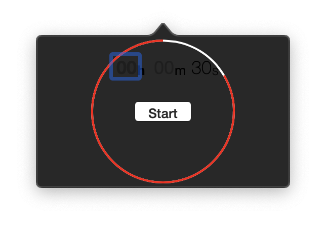

# iTuneZzz
Set a sleep timer for iTunes

Vintage code from 2014, helpful when you wanted to listen to an audiobook or podcast while going to sleep, back then you couldn't do it from iTunes :)

Right click on the icon to have a menu with the option to quit.

